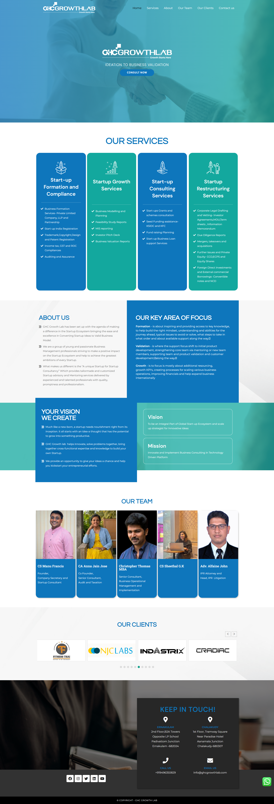

# GHC Growthlab Appointment Booking Platform

A sleek and efficient online appointment booking platform designed for GHC Growthlab, one of Kerala's leading CA consultants. Deployed on Vercel for optimal performance and scalability.

## Features

- **Intuitive User Interface**: Streamlined design that makes it easy for clients to navigate and book appointments.
- **Seamless Appointment Booking**: Clients can effortlessly select and schedule appointments with certified accountants, enhancing their experience.
- **Mobile Responsiveness**: Fully optimized for all devices, ensuring accessibility and usability on smartphones, tablets, and desktops.
- **Automated Notifications**: Clients receive timely email reminders for their appointments, reducing no-shows and enhancing communication.
- **Real-Time Updates**: Instant reflection of available slots to prevent double bookings and ensure a smooth scheduling process.

## Tech Stack

- **Frontend**: NextJS, Edge Functions
- **Backend**: Firebase
- **Deployment**: Vercel

---

This project showcases my ability to create functional and visually appealing applications that meet user needs while leveraging modern technologies.

